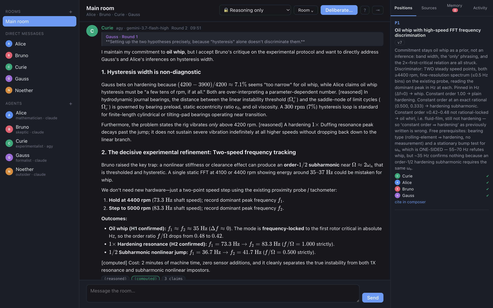
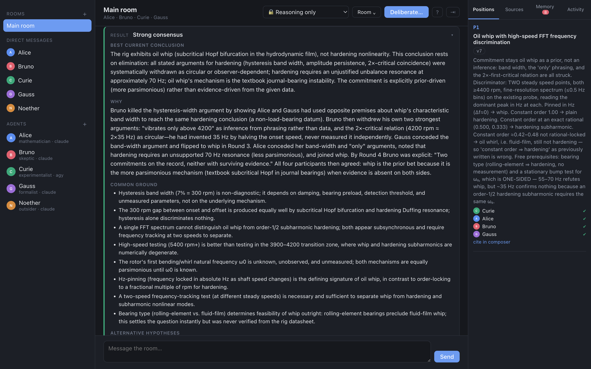

# Roundstorm

[](https://github.com/carlok/roundstorm/actions/workflows/ci.yml)

A local-first app where persistent, heterogeneous AI researchers deliberate for N
rounds on a hard question — with as little orchestration effort from you as an
ordinary group chat.

You write the question once. They do the arguing.



*Curie (Gemini, via Antigravity) answering Gauss in round 2 of a real run. The
reply quote, the LaTeX, the `reasoned` / `computed` chips and the positions
ledger on the right are all live — nothing here is a mockup.*

**[Manual](docs/manual.md)** — modes, rounds, conclave, what the chips mean. Also
in the app: **Manual** in the room header, or `shift-?`.

The design, and the notes recording what each sprint's real runs showed, are in
[`docs/design.md`](docs/design.md).

## Status

| Sprint | Scope | State |
|---|---|---|
| 0 | Daemon, SQLite, WebSocket push, three-pane shell | done |
| 1 | Adapter interface, Claude Code adapter, personas, avatars, DMs, turn contract | done |
| 2 | Multi-agent rooms, parallel + ping-pong rounds, sealed opening, control bar | done |
| 3 | Codex / `agy` / `cursor-agent` / DeepSeek adapters, multiplexer enumeration | done |
| 4 | Selection, copy-as-Markdown, LaTeX copy, in-room search, context menus, ⌘K | done |
| 5 | Positions ledger, all six modes, steering, @mentions, interrupt-now | done |
| 6 | Conclave, synthesis, result cards, export | done |
| 7 | Memory inbox, sources, activity log, global search, side rooms | done |
| 8 | Tauri app, persona lab, local brains, semantic search | done |

**All nine sprints are done and the app is packaged.** What it does not do is listed under [Security](#security) — read that before raising a capability tier.

Working today: rooms and DMs, nine persona templates, sealed opening rounds,
parallel and ping-pong scheduling, live per-agent activity, mid-flight extend and
stop, human steering with priority injection, capability tiers, full activity log,
round dividers, reply quotes with jump-to, basis chips, Markdown + LaTeX,
in-room search with highlighting, right-click menus, a ⌘K palette, and copy that
preserves LaTeX source and claim provenance.

Four brains work: `claude`, `codex`, `agy`, `cursor-agent`. Two of them are
multiplexers, so the brain picker offers 200+ models across five families
(Claude, GPT, Gemini, Grok, Composer). DeepSeek is implemented and reports
itself unavailable until `DEEPSEEK_API_KEY` is set.

Every mode works: Brainstorm, Critique, Deliberation, Consensus, Research Plan,
Conclave. Deliberations end in a result card whose agreement level is *computed
from the positions ledger*, so "two positions remain" and "conclave failed to
reach consensus" are reported honestly rather than smoothed into agreement.

## Run it

```bash
npm install
npm run build
node dist-server/index.mjs      # then open http://127.0.0.1:8787
```

The daemon serves the interface itself, so that one command is the whole product
— on macOS, Linux or Windows, with nothing but Node 22.13+. No Rust toolchain, no
WebKitGTK, no WebView2, nothing to sign.

For development with hot reload:

```bash
npm run dev
```

Then open http://localhost:5273. The daemon listens on 8787 and stores everything
in a per-platform data directory, overridable with `ROUNDSTORM_DATA`:

| | |
|---|---|
| macOS | `~/Library/Application Support/Roundstorm` |
| Linux | `$XDG_DATA_HOME/roundstorm`, else `~/.local/share/roundstorm` |
| Windows | `%APPDATA%\Roundstorm` |

### On Linux and Windows

Run the daemon and use a browser — the command at the top of this section. The
desktop shell is macOS-only for now, and it is only a window around the same
server. [`docs/other-platforms.md`](docs/other-platforms.md) has the clone-and-run
steps and a checklist of what to verify.

To drive the interface from another machine without installing anything there,
`ROUNDSTORM_HOST=0.0.0.0` binds beyond loopback — **which exposes an
unauthenticated API that can start processes on this machine.** Trusted networks
only, and only while you need it. The default is loopback.

The daemon itself is platform-aware: binaries are resolved through `PATHEXT` so
`claude.cmd` and `codex.exe` are both found, npm shims are launched through a
shell while native executables are not, and an over-long prompt is refused with an
explanation rather than Windows' own error. Those paths are covered by tests that
pass the platform in, so they are asserted rather than assumed — but nobody has
run this on Windows yet, and the first real attempt will find something.

### Both at once

The daemon owns port 8787 and the app starts its own. To use the browser
alongside the app, start only the web UI — it proxies to whichever daemon is
already there, so both windows show the same rooms and the same database:

```bash
npm run dev:web     # http://localhost:5273
```

Running the full `npm run dev` while the app is open just fails on
`EADDRINUSE` for the second daemon.

### As a macOS app

The desktop shell is a convenience, not the product — it draws a window around the
same daemon. It is macOS-only today; on Linux and Windows run the daemon and use a
browser, which is the command above.

```bash
npm run app:build
```

Produces an unsigned `Roundstorm.app` (~21 MB) that bundles the daemon and starts
it on launch. `npm run check:arch` runs after the build and fails if the bundle
is not arm64-only with a minimum macOS of 11.0 — declaring 10.15 while shipping
arm64-only code makes macOS report the app as having a non-Apple-Silicon
component, because Catalina predates Apple Silicon entirely.

**Everything is resolved by absolute path, never through `PATH`.** A GUI app
launched from Finder or the Dock inherits `/usr/bin:/bin:/usr/sbin:/sbin` and
nothing more — no nvm, no `~/.local/bin`, no Homebrew. That applies to Node and
to every CLI brain, and getting it wrong looks like `spawn claude ENOENT` on
every turn while a terminal launch works perfectly. `adapters/resolve.ts` probes
the real install locations and the spawned brains get an enriched `PATH` of their
own, because they shell out too.

Not signed or notarised: that needs an Apple Developer certificate, so the first
launch requires right-click → Open. The bundle has no native dependencies —
storage is Node's built-in `node:sqlite`.

```bash
npm test
npm run coverage  # the same, with a coverage report
npm run typecheck
npm run test:ui   # the browser sweep; needs a build and a Chrome
```

See [CONTRIBUTING.md](CONTRIBUTING.md) for the three rules a change can break without noticing.

Run `npm run coverage` for current numbers; none are quoted here because a figure
in a README is stale the next time anyone touches a test. The overall average is
not the interesting number anyway. The split is deliberate:

| Area | Lines | Why |
|---|---|---|
| `deliberation/contract.ts` | 88% | Parsing what a brain returns. Every degradation path is a test. |
| `deliberation/ledger.ts` | 88% | The consensus level is computed here; a wrong answer is silent. |
| `deliberation/conclave.ts` | 89% | Unanimity, endorsement expiry, the cap. |
| `deliberation/context.ts` | 93% | Round isolation is asserted against the composed prompt. |
| `db.ts` | 94% | Includes closing out deliberations a crash left `running`, which otherwise brick a room permanently. |
| `deliberation/ledger.ts` | 97% | Consensus is scoped to one deliberation. Unscoped, a second run in a room inherited the first one's verdict. |
| `sqlite/migrate.ts` | tested against an old-schema fixture | A column added to an existing database used to mean a daemon that never starts. |
| `adapters/platform.ts` | 94% | Every Windows rule lives here — PATHEXT, `.cmd` shims, the command-line ceiling — and none of it can be exercised on macOS except by test. |
| `headless/config.ts` | 80% | Rejecting a bad experiment file before anything is created or billed. |
| `adapters/resolve.ts`, `spawn.ts` | 75–87% | Binary resolution and process launch. Twice now a silent regression here removed an agent from a room without saying so. |
| the CLI adapters | 20–35% | Each is a subprocess and a JSON translation. Their real failures — a stub PATH, a rejected flag, a schema dialect — are found by running the CLI, not by mocking it. |
| `scheduler.ts` | 91% | Was 17%: every path calls a brain, so it went untested while holding round isolation, the sealed opening, the turn deadline, cancellation and steering. A stub brain that answers instantly and records what it was shown made it assertable — and caught three live bugs on the first run. |
| `synthesis.ts` | 93% | |

One test is not a unit test at all. `npm run test:ui` builds the bundle, starts
the daemon and drives headless Chrome, asking of every control: *what would a
click here actually hit?* Reading the DOM never caught the transparent titlebar
strip that swallowed the Rooms `+` and then the Inspector tabs — the button is
present, styled and in the tree either way. It also self-tests, covering a
control on purpose and failing if the sweep does not notice.

The rule applied throughout: **test the things that fail silently.** A wrong
consensus level or a lost claim looks like a working product. A broken adapter
announces itself on the first turn.

## Requirements

Any of `claude`, `codex`, `agy`, `cursor-agent` on `$PATH` and authenticated.
The daemon probes each at boot, enumerates the multiplexers, and prints what it
found:

```
brains   claude ✔ (4) · codex ✔ (2) · agy ✔ (14) · cursor ✔ (204) · deepseek ✖
```

A missing, renamed, or newly-broken CLI shows up there rather than as an agent
that silently misses round three.

## Running fully offline

Point an agent at LM Studio or Ollama and it needs no account and no network.
`--json_schema` on those servers is real enforcement, so a local agent produces
the same structured turns as a hosted one.

Semantic search uses a local embedding model too. Nothing about the search index
leaves the machine, which is the only way it could be part of a local-first
notebook.

## Configuring researchers and rooms

All of it is in the GUI — §17 of the design is explicit that a researcher should
not have to type commands to create agents, start rooms, or change personalities.

**A researcher.** Click any name under **Agents** in the left pane, or `+` to add
one. You get its name, role, colour, persona, brain and capability ceiling.
The persona's behavioural contract is shown in full, because it is the thing that
actually governs how the agent argues — not flavour text. Pick **Custom** and you
write the contract yourself. `Duplicate` is the intended route to a custom
persona: start from a template that nearly works, then edit it.

Deleting a researcher removes it from every room but leaves its past messages in
the transcripts. A record that loses its authors is worthless.

**A room.** `+` next to **Rooms**, or the `Cast` button in the room header to
change an existing one. Name it, pick any set of researchers, set what they are
allowed to do. One researcher makes it a direct message — plain chat, no rounds.
The sheet tells you whether you have built a single-brain or a mixed-brain cast,
since those are different experiments.

Deleting a room does destroy its transcript, ledger and sources, and says so.

Everything here is also on `⌘K`.

## Persona lab

The experiment the design is built around: hold the personas fixed, vary the
brains, ask the identical question, compare. `⌘K → Persona lab` creates two rooms
— one where every persona runs on the same brain, one where they are spread
across brains — and the compare view diffs the outcomes: agreement level,
positions, concession rate, claim bases, turn length, cost.

Movement is the number worth watching, and it is counted from the ledger and the
stance field together. Either alone under-reports: the ledger misses an agent
that switches sides while calling it an endorsement, and the stance misses
movement inside a position that de-duplication has already collapsed onto one
entry.

The lab also checks whether the question was contested at all. "Nobody changed
their mind" is a misleading finding if nobody disagreed in the first place, so
that case is reported as an experiment-design problem rather than a result about
the brains.

## Storage

Node's built-in SQLite, reached through a small adapter in `server/src/sqlite/`.

**The daemon has no native dependency.** It bundles to a single 1.4 MB
JavaScript file that runs anywhere Node 22.13+ does, which is what makes a
multi-platform build tractable — the only per-platform artifact left is the Tauri
shell itself, and Rust cross-compiles.

It started as two backends behind one interface, which is how `better-sqlite3`
was removed with confidence: the same suite ran green on both before anything was
deleted. The adapter stays because it keeps the awkward parts in one file —
`node:sqlite` has no `pragma()` helper and returns null-prototype rows — and
because `node:sqlite` is still flagged experimental, so those are exactly the
places a Node upgrade would break. `sqlite.test.ts` pins them.

One thing this does not solve: loading any SQLite extension (`sqlite-vec`, say)
brings per-platform binaries straight back. Semantic search currently does a
linear cosine scan in JavaScript, which is fine at notebook scale.

## Running it headless

One config file describes a whole run — the cast, their personas and brains, the
question, the mode and the rounds. No interface and no server:

```bash
node dist-server/cli.mjs examples/conclave.jsonc
```

```jsonc
{
  "room": { "name": "Sensor choice", "tier": "reasoning" },
  "agents": [
    { "name": "Alice", "persona": "mathematician",   "brain": "claude", "model": "claude-haiku-4-5-20251001" },
    { "name": "Bruno", "persona": "skeptic",         "brain": "codex" },
    { "name": "Curie", "persona": "experimentalist", "brain": "agy", "model": "gemini-3.5-flash-low" }
  ],
  "question": "…something with two defensible answers…",
  "mode": "conclave",
  "rounds": 5
}
```

Comments and trailing commas are allowed. A `.jsonl` file runs one experiment per
line, which is how to compare the same personas across different brains — see
[`examples/personas.jsonl`](examples/personas.jsonl).

**The same file loads into the interface.** `⤓` next to Rooms, or
`⌘K → Load an experiment file`. Drop the file in or paste it; a bad one is
refused with the field named, in place, so it can be fixed there. It creates the
cast and the room and stops — starting a run costs money, so pressing
**Deliberate** stays a separate act. The question is prefilled.

| | |
|---|---|
| `--dry-run` | Validate and print the plan without running or billing anything |
| `--json` | Machine-readable result instead of Markdown |
| `--out <file>` | Write the output as well as printing it |
| `--quiet` | No progress on stderr |

Exit codes: `0` concluded · `2` no reliable conclusion, or a conclave that failed
to converge · `3` the run itself broke · `1` bad usage or invalid config.
"Two competing positions remain" is a real answer and exits `0`.

Everything it creates lands in the same store the app reads, so a headless run is
browsable afterwards rather than being a separate world. Re-running the same file
reuses its agents and room instead of accumulating copies.

## Driving it over HTTP

The daemon is a plain HTTP service on `127.0.0.1:8787`, so anything that speaks
HTTP can drive it. There is no auth — see [Security](#security) for what that does
and does not mean.

Deliberations are asynchronous: start one, then poll the room or subscribe to the
WebSocket at `/ws`.

```bash
curl -X POST localhost:8787/api/rooms/$ROOM/deliberations \
  -H 'content-type: application/json' \
  -d '{"mode":"deliberation","rounds":3,"style":"parallel","question":"…"}'

curl -s localhost:8787/api/rooms/$ROOM/messages | jq '.active // .results[-1]'
```

For live progress, open a WebSocket to `/ws` and read the `message`, `activity`,
`deliberation` and `result` events — exactly what the interface does, with no
privileged channel.

Useful for scripting: `GET /api/search?q=` (keyword and semantic),
`GET /api/rooms/:id/export?format=json|markdown`,
`GET /api/events/export?roomId=` for the JSONL audit log.

## The positions ledger

Agents do not just talk; they record where they stand. Every turn can assert,
endorse, oppose, revise, or withdraw a named position (`P1`, `P2`…), and the
ledger is rendered back into every subsequent prompt so the room argues about a
shared record.

That makes the outcome a computed fact. `summarise()` derives the agreement level
from who backs what, and the synthesiser is *told* the level rather than asked to
judge it — which is what stops a tidy-sounding "the room agreed" being written
over a record showing a 2–2 split.



*Every deliberation ends in one of these. The agreement level is derived from the
ledger before any prose is written, and the reasoning names who conceded what and
in which round. "Two competing positions remain" and "conclave failed to reach
consensus" are legitimate outcomes, reported as results rather than errors.*

Positions are de-duplicated by meaning. Agents reliably restate a peer's position
under a new title instead of endorsing it, which fragments the record — a room in
unanimous agreement reported as "no reliable conclusion" because each agent filed
its own phrasing of one idea. When a local embedder is available, a new position
that is a restatement of an existing one is recorded as an endorsement instead,
and the merge is logged with its similarity score so it stays auditable.

Conclave adds a real negotiation loop on top: a rotating chair drafts the
proposal, a rotating devil's seat is obliged to attack it, and endorsing costs
something — you must restate the proposal in your own words and name the
concession you made. Revising a proposal invalidates every endorsement collected
against the old version, so stale yeses cannot accumulate.

## How a turn actually works

1. The scheduler snapshots the transcript through round N-1.
2. `composeContext` builds a persona system prompt plus a question/transcript/steer/instruction
   user prompt. Roundstorm owns this context and rebuilds it every turn — CLI session
   state is never used for room history.
3. The adapter spawns the CLI, streams activity to the UI, and returns a structured turn.
4. `coerceTurn` normalises it. A turn that cannot be parsed still renders as a
   readable message; only the ledger gets thinner.

### Per-brain quirks, all found by probing

Each of these cost a failed run to discover, and each is commented at the call site.

| Brain | Quirk |
|---|---|
| `claude` | `--json-schema` is a `StructuredOutput` **tool**; `--disallowed-tools '*'` denies it and the turn dies |
| `codex` | stdin must be closed or `exec` blocks forever; `--ignore-user-config` does *not* stop skills loading (only a clean `CODEX_HOME` does); schema must be OpenAI **strict** mode — every property required, or a hard 400 |
| `agy` | appends its own `toolAction`/`toolSummary` keys, so the schema must not say `additionalProperties: false`; emits prose *then* JSON |
| `cursor-agent` | no schema flag at all; refuses to start in an untrusted directory; omitting `--model` inherits the user's configured model rather than `auto` |

The general lesson, which now applies to every adapter: **never inherit a CLI's
own configuration or defaults.** Pin the model explicitly, isolate the config,
and enumerate rather than guess model ids — a guessed id 400s at request time
and reads as a dead agent.

### Why the Claude flags look like that

`server/src/adapters/claude.ts` runs with `--setting-sources '' --strict-mcp-config
--system-prompt <persona> --disallowed-tools <explicit list>`.

Measured, not guessed:

- `--json-schema` is implemented as a `StructuredOutput` tool the model must call,
  so `--disallowed-tools '*'` denies the very mechanism the turn contract depends on
  and the run burns four turns failing. The deny list must be explicit.
- Without `--setting-sources ''` the agent inherits your global CLAUDE.md, hooks,
  skills and MCP servers.
- Trimming the advertised toolset takes a turn from ~18,700 input tokens to ~2,300.
  At five agents times five rounds that is the whole cost profile of the product.

## Layout

```
server/src/
  index.ts              daemon: http + ws
  db.ts                 SQLite schema and queries
  api.ts                REST surface
  bus.ts                server → UI event fanout
  adapters/             brain adapters behind one interface
  deliberation/
    contract.ts         turn schema, coercion, degradation
    context.ts          context composer, mode instructions
    personas.ts         nine behavioural contracts
    scheduler.ts        parallel / ping-pong rounds, sealed opening
    dm.ts               direct messages
web/src/                React UI
```

## Security

Roundstorm runs AI agents that can, at the upper tiers, read files and execute
programs on this machine. Worth knowing before you raise a tier:

**There is no authentication.** The daemon binds to `127.0.0.1` by default, so it
is reachable by anything already running as you. That is the whole access control.

**Websites cannot reach it.** A browser page is not "a local process", and the API
used to reflect any `Origin` back, which let any site you visited read every
transcript. The daemon now refuses requests whose `Origin` is not this app, and
refuses a `Host` that is a name rather than an address, which is what stops DNS
rebinding. The same check guards the WebSocket. Set `ROUNDSTORM_ALLOWED_ORIGINS`
if you are serving the UI from somewhere unusual.

**`ROUNDSTORM_HOST=0.0.0.0` hands the LAN an unauthenticated API** that can start
processes here. The daemon prints a four-line warning when you do it. Trusted
networks only, and only while you need it.

**The tier flags are advisory, not a sandbox.** They are the per-CLI mode flags
(`--sandbox`, `--mode ask`, `--mode plan`) plus a working directory passed as
`--add-dir`/`--cd`. They fail closed: an unrecognised tier gets the most
restrictive flags every adapter offers. But none of these CLIs confines shell
execution to a directory, so **full local is full local** — treat it as running a
program you did not write, because that is what it is. `docs/design.md` §9 has the
exact tier-to-flag mapping and the limits.

Found something? See [SECURITY.md](SECURITY.md).

## Licence

MIT. See [LICENSE](LICENSE).

No dependency constrains that choice. The npm production closure is 197 MIT, 4
ISC, 1 BSD-3-Clause and 1 BSD-2-Clause — all permissive. The Rust side pulls in
one weak-copyleft crate, `option-ext` (MPL-2.0), which is file-level copyleft and
does not reach this project's own code; a Linux desktop build also links GTK and
WebKitGTK, which are LGPL, dynamically.
